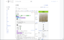
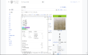
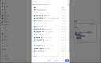
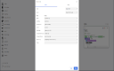

# Rikaitan

## What's Rikaitan?<!-- omit from toc -->

Rikaitan turns your web browser into a tool for building Japanese language literacy
by helping you **read** texts that would otherwise be too difficult to tackle.

Rikaitan provides powerful features not available in other browser-based dictionaries:

- 💬 Interactive popup definition window for displaying search results.
- ✍️ Kanji stroke order diagrams are just a click away.
- 📝 [Automatic flashcard creation](./docs/anki-integration.md#anki-integration) for the [Anki](https://apps.ankiweb.net/) flashcard program via the [AnkiConnect](https://ankiweb.net/shared/info/2055492159) plugin.
- 🔍 Custom search page for easily executing custom search queries.
- 📖 Support for multiple dictionary formats including [EPWING](https://ja.wikipedia.org/wiki/EPWING) via the [Rikaitan Import](https://github.com/Ajatt-Tools/rikaitan-import) tool.
- ✨ Clean, modern code makes it easy for developers to [contribute](#contributing) new features and languages.

## Project Background

**Rikaitan is the successor to Yomichan** ([migration guide](./docs/yomichan-migration.md#migrating-from-yomichan)).
The original developer quit and deleted Yomichan from extension stores.
Our primary objective is to maintain the project,
ensuring it remains functional on the most recent browser versions
and that any bugs are fixed.

Since this is a distributed effort, we **highly welcome new contributors**!
Feel free to browse the [issue tracker](https://github.com/Ajatt-Tools/rikaitan/issues),
and read our [contributing guidelines](./CONTRIBUTING.md).
If you want to add or improve support for a language,
read the documentation on [language features](./docs/development/language-features.md).
You can also find us on [DJT](https://tatsumoto.neocities.org/blog/join-our-community).

## Helpful information

- ✨ [Migrating from Yomichan (legacy)](./docs/yomichan-migration.md)
- Installation and Setup
  - 📚 [Recommended Dictionaries](./docs/dictionaries.md#recommended-dictionaries)
  - 🗂️ [Importing and exporting dictionaries](./docs/dictionaries.md#importing-a-dictionary-collection)
- Anki Integration
  - 📇 [Anki integration and flashcard creation guide](./docs/anki-integration.md)
  - 🔧 [Anki handlebar templates](./docs/templates.md)
- Advanced Features
  - ⌨️ [Keyboard shortcuts](./docs/keyboard-shortcuts.md)
  - 🔍 [Advanced options, including MeCab](./docs/advanced-options.md)
  - 🔊 [Adding custom audio sources](./docs/audio.md)
- Troubleshooting
  - 🕷️ [Known browser bugs](./docs/browser-bugs.md)
  - ❓ [Frequently asked questions](./docs/faq.md)
- 🔒 [Browser Permissions](./docs/permissions.md)

## Installation

Rikaitan is available for
[Firefox](https://wiki.archlinux.org/title/Firefox)-based web browsers
and
[Chromium](https://wiki.archlinux.org/title/Chromium)-based web browsers.
We recommend [LibreWolf](https://librewolf.net/) as your everyday web browser.
[Ungoogled-chromium](https://aur.archlinux.org/packages/ungoogled-chromium) is a good alternative.

**Download from Firefox Browser add-ons:**

**Download from Chrome Web Store:**

**Note**: [chromium-web-store](https://github.com/NeverDecaf/chromium-web-store)
can be used to allow installing extensions directly from Chrome Web Store.

## Basic Usage

1.  Click the  _Rikaitan_ button in the browser bar to open the quick-actions popup.

    

    - The  _cog_ button will open the Settings page.
    - The  _magnifying glass_ button will open the Search page.
    - The  _question mark_ button will open the Information page.
    - The  _profile_ button will appear when multiple profiles exist, allowing the current profile to be quickly changed.

2.  Import the dictionaries you wish to use for term and kanji searches; head over to the [dictionary docs](./docs/dictionaries.md) to get set up! If you do not have any dictionaries installed or enabled, Rikaitan will warn you that it is not ready for use by displaying an orange exclamation mark over its icon. This exclamation mark will disappear once you have installed and enabled at least one dictionary.

    

3.  Webpage text can be scanned by moving the cursor while holding a modifier key, which is <kbd>Shift</kbd> by default. If definitions are found for the text at the cursor position, a popup window containing term definitions will open. This window can be dismissed by clicking anywhere outside of it.

    

4.  Click on the  _speaker_ button to hear the term pronounced by a native speaker. If an audio sample is not available, you will hear a short click instead. For more options, see [Audio Configuration](./docs/audio.md).

5.  Click on individual kanji in the term definition results to view additional information about those characters, including stroke order diagrams, readings, meanings, and other useful data.

    

To further enhance your Rikaitan experience,
it's worth [integrating with Anki](./docs/anki-integration.md),
a spaced-repetition flashcard program to help solidify the words you encounter.

## Contributing

Since this is a distributed effort, we **highly welcome new contributors**! Feel free to browse the [issue tracker](https://github.com/Ajatt-Tools/rikaitan/issues), and read our [contributing guidelines](./CONTRIBUTING.md).

Here are some ways anyone can help:

- Try using the Rikaitan dev build. Not only do you get cutting edge features, but you can help uncover bugs and give feedback to developers early on.
- Document any UI/UX friction in Github Issues. We're looking to make Rikaitan more accessible to non-technical users.
- All the issues in `area/bug` older than 2 months need help reproducing. If anything interests you, please try to reproduce it and report your results. We can't easily tell if these issues are one-off, have since been resolved, or are no longer relevant.

> The current active maintainers of Rikaitan spend a lot of their time debugging and triaging issues. When someone files a bug report, we need to assess the frequency and severity of the bug. It is extremely helpful if we get multiple reports of people who experience a bug or people who can contribute additional detail to an existing bug report.

If you're looking to code, please let us know what you plan on working on before submitting a Pull Request. This gives the core maintainers an opportunity to provide feedback early on before you dive too deep. You can do this by opening a Github Issue with the proposal.

Some contributions we always appreciate:

- Well-written tests covering different functionalities. This includes [playwright tests](https://github.com/Ajatt-Tools/rikaitan/tree/master/test/playwright), [benchmark tests](https://github.com/Ajatt-Tools/rikaitan/tree/master/benches), and unit tests.
- Increasing our type coverage.
- More and better documentation!

Information on how to setup and build the codebase can be found [here](./CONTRIBUTING.md#setup).

If you want to add or improve support for a language, read the documentation on [language features](./docs/development/language-features.md).

Feel free to join us on [DJT 🍔](https://tatsumoto.neocities.org/blog/join-our-community).

## Licenses

Required licensing notices for this project follow below:

- **EDRDG License** \
  This package uses the [EDICT](https://www.edrdg.org/jmdict/edict.html) and
  [KANJIDIC](https://www.edrdg.org/wiki/index.php/KANJIDIC_Project) dictionary files. These files are the property of
  the [Electronic Dictionary Research and Development Group](https://www.edrdg.org/), and are used in conformance with
  the Group's [license](https://www.edrdg.org/edrdg/licence.html).

- **Kanjium License** \
  The pitch accent notation, verb particle data, phonetics, homonyms and other additions or modifications to EDICT,
  KANJIDIC or KRADFILE were provided by Uros Ozvatic through his free database.

## Third-Party Libraries

Rikaitan uses several third-party libraries to function.
Below are links to homepages, snapshots,
and licenses of the exact versions packaged.

<!-- The following table is generated using the command `npm run license-report:markdown`. -->

| Name                | Installed version | License type | Link                                             |
| :------------------ | :---------------- | :----------- | :----------------------------------------------- |
| @zip.js/zip.js      | 2.7.32            | BSD-3-Clause | git+https://github.com/gildas-lormeau/zip.js.git |
| dexie               | 3.2.4             | Apache-2.0   | git+https://github.com/dfahlander/Dexie.js.git   |
| dexie-export-import | 4.0.7             | Apache-2.0   | git+https://github.com/dexie/Dexie.js.git        |
| rikaitan-handlebars | 1.0.0             | MIT          | n/a                                              |
| parse5              | 7.1.2             | MIT          | git://github.com/inikulin/parse5.git             |
| wanakana            | 5.3.1             | MIT          | git+ssh://git@github.com/WaniKani/WanaKana.git   |
| hangul.js           | 0.2.6             | MIT          | git+https://github.com/e-/Hangul.js.git          |
